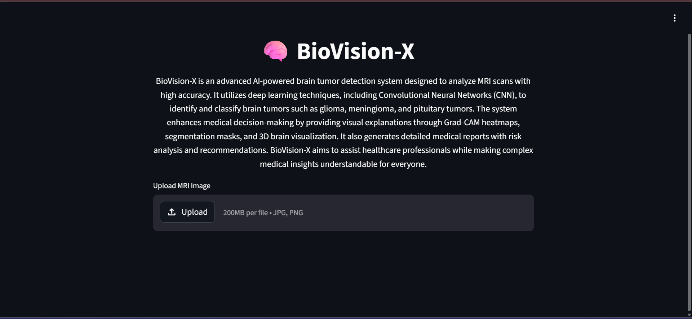
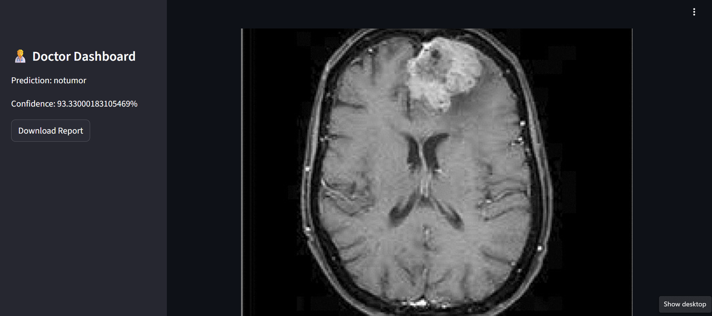
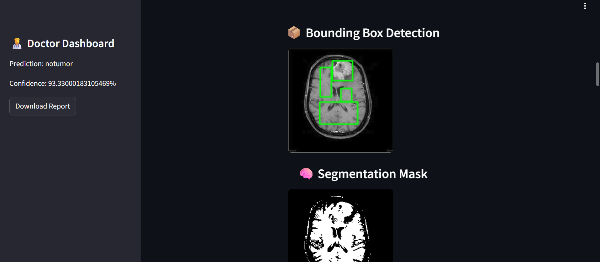
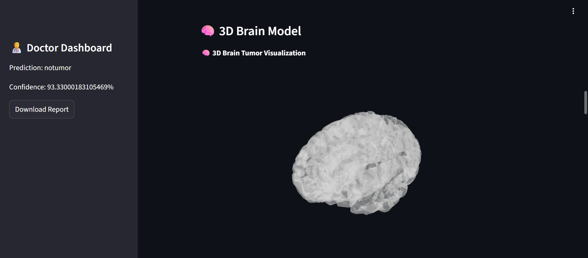
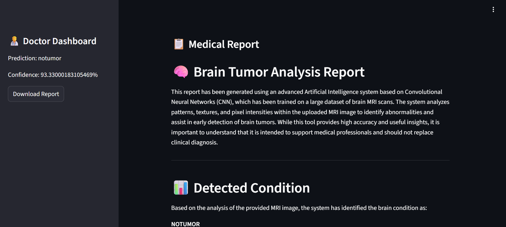
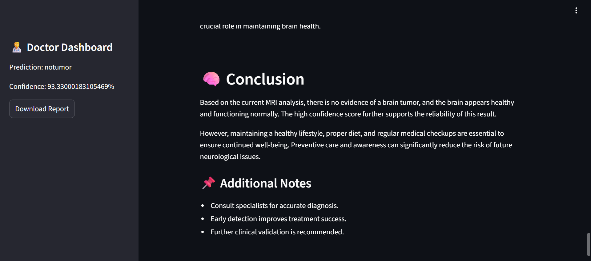

# 🧠 BioVision-X  
### AI-Powered Brain Tumor Detection & Medical Recommendation System

BioVision-X is an advanced AI-powered healthcare application designed to analyze MRI brain scans and detect brain tumors using Deep Learning and Computer Vision techniques. The system provides intelligent tumor prediction, confidence analysis, medical reports, and healthcare recommendations through an interactive dashboard.

---

# 🌟 Features
- Brain Tumor Detection using CNN
- MRI Image Classification
- AI-Based Medical Report Generation
- Confidence Score Prediction
- Interactive Doctor Dashboard
- Real-Time MRI Image Analysis
- Medical Recommendation System
- 3D Brain Visualization
- Streamlit-Based Web Application

---

# 🧠 Technologies Used
- Python
- TensorFlow / Keras
- OpenCV
- CNN (Convolutional Neural Networks)
- NumPy
- Pandas
- Matplotlib
- Scikit-learn
- Streamlit

---

# 🖥️ Website / Dashboard Preview

---

## 👨‍⚕️ Dashboard
Interactive healthcare dashboard displaying prediction details and downloadable reports.



---

## 🏠 Input Image
The homepage allows users to upload MRI images and start tumor analysis through an AI-powered healthcare interface.



---

## 📊 Data Analysis Dashboard
Displays dataset insights, preprocessing analysis, and model-related visualizations.


---

## 🧠 Tumor Detection Dashboard
Shows real-time tumor prediction results with confidence scores and MRI scan visualization.



---

## 🧠 3D Brain Visualization
Provides enhanced visualization of MRI brain structures and analysis outputs.



---

## 📋 AI Medical Report
Automatically generated AI-powered medical report containing tumor analysis and recommendations.



---

## ✅ Final Prediction & Conclusion
Displays the final analysis result with AI-generated conclusions and recommendations.



---

# 📊 Dataset
The project uses Brain MRI image datasets containing tumor and non-tumor MRI scans for image classification and prediction.

### Dataset Includes:
- Brain MRI Images
- Tumor MRI Scans
- Non-Tumor MRI Scans
- Medical Imaging Data

### Classification:
- **0:** No Tumor Detected
- **1:** Tumor Detected

---

# 🧠 Model Workflow
1. Upload MRI brain image  
2. Preprocess image using OpenCV  
3. Extract image features  
4. Run CNN-based deep learning model  
5. Detect tumor presence  
6. Generate prediction confidence score  
7. Create AI medical analysis report  
8. Display healthcare recommendations  

---

# 📈 Model Capabilities
- Brain MRI Classification
- Tumor Detection
- Confidence Analysis
- Medical Report Generation
- AI Recommendation Support
- Computer Vision-Based Prediction
- Deep Learning Medical Analysis

---

# 📂 Project Structure

```bash
BioVision-X/
│
├── Images/
│   ├── 3D-Preview.png
│   ├── Conclusion.png
│   ├── Dashboard.png
│   ├── Detection.png
│   ├── Input.png
│   ├── Report.png
│   └── data analysis.png
│
├── BioVision-X.ipynb
├── README.md
└── requirements.txt
```

---

# 🚀 Run the Project

## 🧰 Install Requirements

```bash
pip install -r requirements.txt
```

---

## ▶️ Run Jupyter Notebook

```bash
jupyter notebook
```

Open:
```bash
BioVision-X.ipynb
```

---

# 📚 Learning Outcomes
- Deep Learning & CNN Models
- Medical Image Processing
- AI Healthcare Applications
- TensorFlow Model Development
- Computer Vision Techniques
- MRI Image Classification
- Dashboard & UI Development
- AI-Based Report Generation

---

# 🔮 Future Enhancements
- Multi-Class Tumor Detection
- Grad-CAM Heatmaps
- Cloud Deployment
- Real-Time Hospital Integration
- AI Medical Chatbot
- Advanced Report Analytics

---

# 📌 Conclusion
BioVision-X demonstrates the real-world application of Artificial Intelligence in healthcare by combining Deep Learning, MRI image analysis, medical reporting, and interactive dashboards to support brain tumor detection and healthcare assistance.

---
